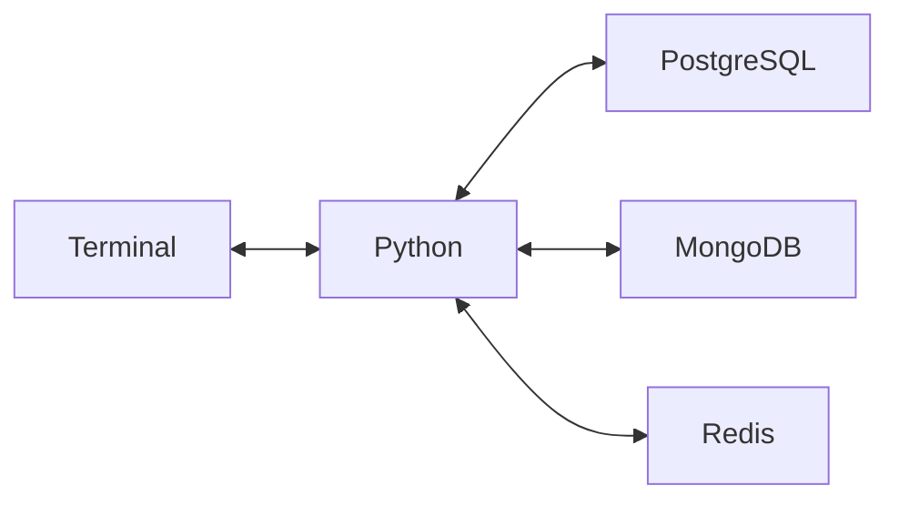

# CC6240: Polyglot Persistence

## 1. Explicação do Tema Escolhido

O tema selecionado para a implementação deste projeto é um **Marketplace de Produtos Variados**.

A escolha deste cenário justifica-se pela sua aderência natural aos desafios de armazenamento do mundo real, tornando-se o ambiente perfeito para o estudo e aplicação da **Persistência Poliglota**. Em um sistema de e-commerce moderno e escalável, o backend precisa lidar simultaneamente com diferentes comportamentos de dados:

* **Dados Transacionais e de Domínio Estrito:** Informações sensíveis de clientes (autenticação, dados pessoais) e o histórico de pedidos faturados. Estes exigem garantias rígidas de integridade, consistência e relacionamento estrito entre entidades.
* **Catálogos de Dados Dinâmicos e Polimórficos:** Produtos de tecnologia (como teclados mecânicos, placas de vídeo ou monitores) não possuem uma ficha técnica padronizada. Eles exigem esquemas flexíveis para acomodar atributos variados (ex: um teclado tem layout e tipo de switch; um monitor tem taxa de atualização), o que inviabiliza o uso de tabelas relacionais rígidas.
* **Sessões Altamente Voláteis:** Carrinhos de compras são lidos e atualizados a cada segundo pelos usuários, possuindo um alto índice de abandono. Eles exigem operações de leitura e escrita ultrarrápidas, sem onerar o banco de dados principal com lixo eletrônico persistente.

Desta forma, a aplicação proposta gerencia o ciclo completo de uma plataforma de vendas: desde o cadastro seguro do usuário, passando pela navegação em um catálogo com esquemas flexíveis, o acúmulo de itens em um carrinho efêmero na memória, até a orquestração e consolidação financeira através de um mecanismo de checkout baseado em transação distribuída.

## 2. Arquitetura e Justificativa de Persistência Poliglota

O backend foi implementado utilizando **Python com o framework FastAPI**, desenhado de forma assíncrona para garantir alta performance de I/O na comunicação com múltiplos bancos na nuvem. A arquitetura segue uma separação clara de responsabilidades (Rotas, Schemas/Pydantic, Modelos/SQLAlchemy e Serviços), culminando em uma rota de Checkout que implementa uma Transação Distribuída (Padrão Saga) para coordenar a consistência entre os três bancos de dados.

A escolha dos bancos de dados foi guiada estritamente pela natureza de cada dado:

* **Banco Relacional (PostgreSQL via Supabase):** Utilizado para entidades de negócio estritas e relacionais, especificamente **Clientes (Customers)** e **Pedidos Finalizados (Orders)**. A escolha se justifica pela necessidade de conformidade ACID, chaves estrangeiras (Foreign Keys) para integridade referencial e consistência transacional absoluta no momento de registrar uma venda.
* **Document Storage (MongoDB Atlas):** Utilizado para o **Catálogo de Produtos**. A escolha se justifica pela natureza altamente polimórfica de produtos em um marketplace. Através de um schema flexível (campo `technical_details`), podemos armazenar propriedades únicas para cada produto (ex: um teclado tem "switches", um monitor tem "taxa de atualização") sem a necessidade de criar tabelas esparsas cheias de colunas nulas. Utilizamos `Decimal128` nativo para garantir precisão monetária.
* **Key-Value In-Memory (Redis Cloud):** Utilizado para o **Carrinho de Compras**. A justificativa é a volatilidade e a velocidade. Carrinhos de compras são lidos e modificados constantemente antes do checkout e têm alto índice de abandono. Salvar isso em disco (Postgres/Mongo) geraria gargalos de I/O e lixo no banco. No Redis, o carrinho fica na memória RAM, com acesso ultrarrápido e possui um *Time-to-Live* (TTL), expirando automaticamente caso o cliente abandone a sessão.



## 3. Como Executar o Projeto

Este projeto está configurado para consumir serviços na nuvem (Supabase, MongoDB Atlas e Redis Cloud), eliminando a necessidade de contêineres Docker locais complexos para avaliação.

### Pré-requisitos
* Python 3.10 ou superior instalado.
* Credenciais de acesso configuradas no arquivo `.env`.

### Passo a Passo de Execução

**1. Configuração do Ambiente e Variáveis:**
Renomeie o arquivo `.env.example` para `.env` e preencha com as strings de conexão (URLs) dos respectivos bancos de dados. 
*(Nota: Para testes de avaliação, as credenciais de leitura/escrita já devem estar providenciadas neste arquivo).*

**2. Criação do Ambiente Virtual e Instalação de Dependências:**
No terminal, na raiz do projeto, execute:
```bash
# Cria o ambiente virtual
python -m venv venv

# Ativa o ambiente virtual (Linux/macOS)
source venv/bin/activate
# (Se for Windows, use: venv\Scripts\activate)

# Instala todas as dependências necessárias
pip install -r requirements.txt
```
